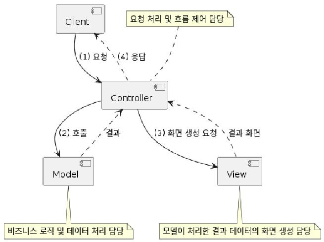
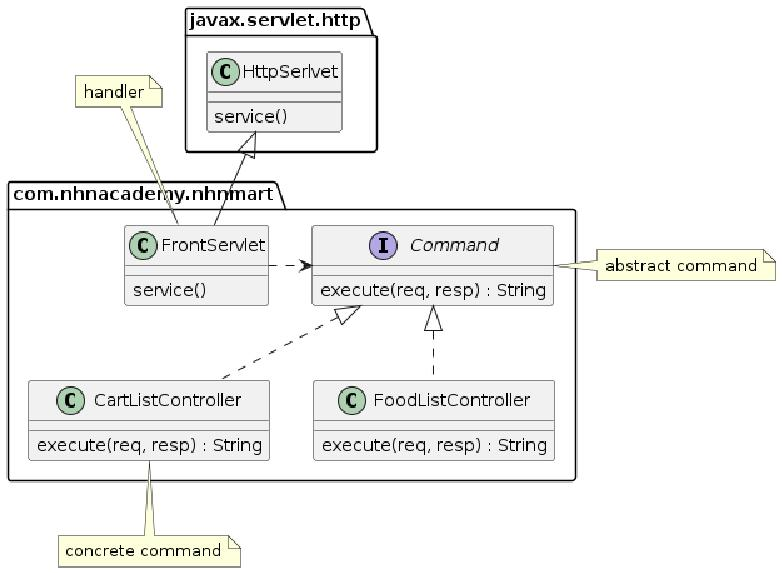
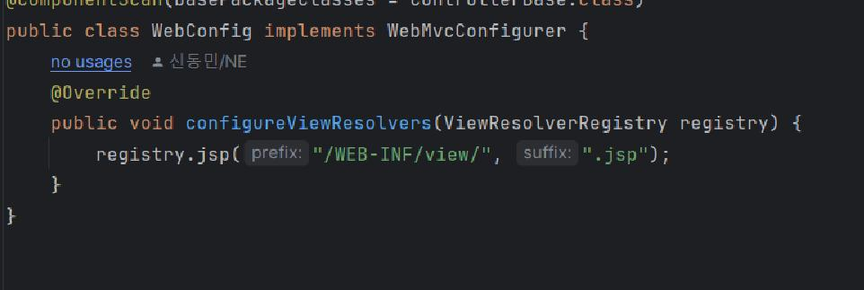
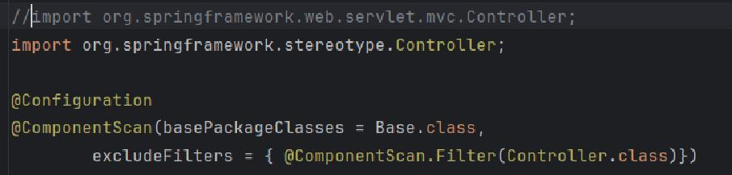

= Spring MVC

== MVC
* 디자인 패턴을 의미함

* MVC 패턴 요약. view=JSP파일, controller=frontservlet(스프링에서는 dispatcherservlet), model=각종 service/controller 등.

* 쇼핑몰 프로젝트 예시

== Front Controller Pattern
* Servlet ApplicationContext: DispatcherServlet, spring의 기본 서블릿, 서비스 bean들을 관리

* view resolver는 webconfig.java에서 수행하고 있다.

== ApplicationContext vs WebApplicationContext
* WebApplicationContext = ApplicationContext + ServletContext 되어 있음
* @EnableWebMvc 어노테이션을 통해 사용
* 추가 설정을 원한다면 WebMvcConfigurer 인터페이스를 implement하거나, WebMvcConfigurationSupport 클래스를 extend하여 구현한다.
* Spring Boot가 좋은 이유: 부트에서는 WebMvcAutoConfiguration 에서 자동으로 해줌
* 요즘은 xml 안쓰고 javaconfig으로 한다.

* 실습: branch "initializer"
** WebApplicationInitializer 상속, AbstractAnnotationConfigDispatcherServletInitializer 상속의 두 가지 방버빙 있다.
** 전자는 자세하지만 복잡해질 수 있고, 후자는 간단하지만 상세한 설정이 불가능하다. 취사선택.

* 실습: springmvc2
** war plugin

[,xml]
----
<build>
    <plugins>
        <plugin>
            <groupId>org.apache.maven.plugins</groupId>
            <artifactId>maven-war-plugin</artifactId>
            <version>3.3.2</version>
        </plugin>
    </plugins>
</build>
----
war plugin import 코드

controller import 시 주의, mvc.controller import 시 오류

== controller
* 요청-처리-흐름 제어
* @Controller annotation을 통해 컴포넌트 스캔 시 bean으로 등록.
* @RestController: viewresolver가 아닌 HttpMessageConverter가 처리

== Request Mapping
* @RequestMapping 어노테이션 사용, 요청을 Controller 메서드에 맵핑

* 사용법은 다음과 같다.
[,java]
----
@RequestMapping(value = "/persons", method=RequestMethod.GET)
@RequestMapping(value = "/persons", method=RequestMethod.POST)
@RequestMapping(value = "/persons", method=RequestMethod.PUT)
@RequestMapping(value = "/persons", method=RequestMethod.DELETE)
@RequestMapping(value = "/persons", method=RequestMethod.PATCH)
@RequestMapping(value = "/persons", method=RequestMethod.HEAD)
@RequestMapping(value = "/persons", method=RequestMethod.OPTIONS)
@RequestMapping(value = "/persons", method=RequestMethod.TRACE)
----

* 어노테이션 일부는 미리 정의되어 있다.

[,java]
----
@GetMapping == @RequestMapping(method=RequestMethod.GET)
@PostMapping == @RequestMapping(method=RequestMethod.POST)
@PutMapping == @RequestMapping(method=RequestMethod.PUT)
@DeleteMapping == @RequestMapping(method=RequestMethod.DELETE)
@PatchMapping == @RequestMapping(method=RequestMethod.PATCH)
----

* request parameter와 연결하는 예시 코드

[,java]
----
//id parameter가 있는 경우에만
@RequestMapping(method = RequestMethod.GET, params = { "id" })
//id parameter가 없는 경우에만
@GetMapping(params = { "!id" })
//type parameter 값이 raw인 경우에만
@GetMapping(params = "type=raw")
//type parameter 값이 raw가 아닌 경우에만
@GetMapping(params = "type!=raw")
----

== Model 이용하기
* model: 스프링에서 데이터를 전달하는 방식.
** Model에 설정한 속성(attribute)이 View에 request.attribute 로 전달됨

* 사용방법

[,java]
----
public String now(Model model) {
        model.addAttribute("now", new Date().toString());

        return "now";
    }
----
위와 같이 메서드 파라미터로 받으면 된다

** 쇼핑몰 프로젝트의 req.setattribute와 동일함, 전달하는 객체가 httpservletrequest에서 model이 되었을 뿐
* model 외에도 java map, spring modelmap 등의 객체를 사용할 수 있다.
* modelandview도 사용할 수 있으나 modelandview는 이제 구식이라 잘 쓰지 않는다.
** modelandview는 파라미터로 안받고 객체를 생성하여 add attribute 한 뒤 modelandview 객체 자체를 리턴하면 된다.

== parameter 받아오기

* @RequestParam 어노테이션 사용

[,java]
----
// request URL
GET http://localhost:8080/persons?order=-createdAt

//Controller Method
@GetMapping("/persons")
public List<Person> getPersons(@RequestParam(name="order") String order) {
    // ...
}
----

== 가변 파라미터 가져오기

* @PathVariable 어노테이션 사용
* 요청 URL의 Resource(Path)을 처리하기 위한 어노테이션
* @RequestMapping 의 path 에 변수명을 입력받기 위한 place holder 가 필요함

[,java]
----
// 요청 URL
GET http://localhost:8080/persons/99499102

// Controller Method
@GetMapping("/persons/{personId}")
public List<Person> getPersons(@PathVariable(name="personId", required=true) Long personId) {
    // ...
}
----
위와 같이 사용

== URL HTTP 헤더 가져오기

* @RequestHeader 어노테이션 사용
* 사용법은 path 등과 유사

== Cookie 값 가져오기

* @CookieValue 어노테이션 사용
* 사용법은 path 등과 유사

